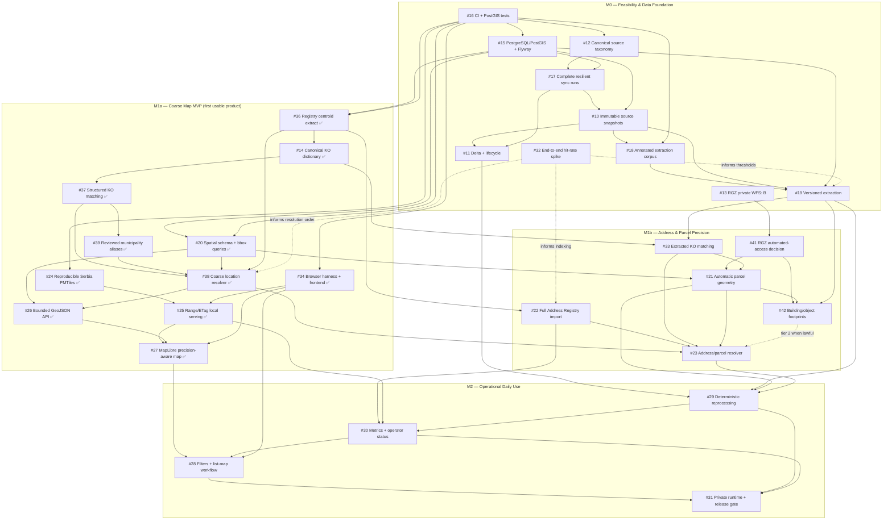

# Aukcije Core — Audited Implementation Roadmap

First audited: 2026-08-21
Re-audited and rewired: 2026-08-21
Reordered for a coarse-map-first MVP: 2026-08-22
GitHub repository: [brzivoz/aukcije_core](https://github.com/brzivoz/aukcije_core)

## Executive summary

The GitHub plan consists of 9 epics and 25 executable implementation/decision issues. Every issue has a priority, a size estimate, a milestone, explicit dependencies, testable acceptance criteria, and required completion evidence.

Both external feasibility gates now have committed outcomes:

- **#13 — REOPENED, option B verified for private use:** the public WFS returned three exact parcel geometries. Access is restricted to an occasional owner-initiated command and private local artifact; the running application still makes zero RGZ requests.
- **#32 — COMPLETE, feasible with a measured ceiling:** every measured auction reached some location tier, but only 16.3% reached address precision; no Address Registry point is promoted to parcel precision.

Three milestones define completion:

| Milestone | Goal | Exit condition |
|---|---|---|
| `M0 — Feasibility & Data Foundation` | Verified source contract, tests, PostGIS, resilient sync, immutable snapshots, measurable parser, both feasibility gates answered | Source can be replayed and reprocessed deterministically with complete-run evidence |
| `M1 — Geospatial Map MVP` | Lawful location resolution, spatial model, offline Serbia basemap, bounded GeoJSON, accessible map | Map works with network restricted to localhost and represents location precision honestly |
| `M2 — Operational Daily Use` | Deterministic reprocessing, status/metrics, unified filters/list-map workflow, hardened private release | Fresh-machine release/backup/restore checklist passes with retained evidence |

The 2026-08-22 reorder acts on the second of those outcomes. #32 measured that
the structured `Place.Cadastral` field carries an official KO name on 100% of
auctions and that 83.7% of all placements are settlement or KO centroids. The
coarse map therefore does not depend on the extraction parser, and the waves
below put it first. See third-audit corrections 19–22.

## Measured source facts

Every figure below was verified directly against the live API on 2026-08-21.

| Query | Result |
|---|---|
| Root `7` (immovable) | `TotalCount` 622, 622 unique IDs |
| Child `47` / `48` / `49` | 445 / 69 / 16, zero pairwise overlap |
| Union of children | 530 — leaving 92 root-only records |
| Root `8` and children `121`/`124`/`135` | 0 |
| Root `2` (movable, out of scope) | 2,237 |
| Records with a future `EndDate` | **602 of 622** |
| Historical records | **20, all from 2023** |
| Retrieval | all 622 returned in **one request** at `ItemCount=3000` |
| Live horizon | every open auction ends within roughly one month |

**This is a small, fast-moving dataset: about 600 live rows on a one-month horizon.** Every sizing decision in the plan should be checked against that number.

## First-audit corrections (retained)

1. **Category ingestion was over-specified and duplicative.** Root `7` returns 622 unique records; children `47`/`48`/`49` are disjoint subsets totaling 530, leaving 92 root-only. #12 discovers by roots `7` and `8`, deduplicates stable IDs, and uses children/detail categories only for classification.
2. **Presence is not activity.** The source includes historical auctions. #11 closes primarily from the source end instant and only uses absence after two complete successful cycles; partial runs cannot mutate lifecycle. (See correction 9 below for the revised magnitude.)
3. **Raw payload replay is real.** #10 stores sanitized, append-only listing+detail JSONB snapshots keyed by canonical content hash. Base64 thumbnails/images and transport secrets are excluded by a versioned minimization policy.
4. **RGZ parcel access is explicit and opt-in.** After the owner narrowed the scope to occasional private non-commercial use, #13 verified option B against a public WFS 2.0.0 contract. A manual one-parcel command produces a private local artifact; application/runtime code never calls RGZ, and missing or failed imports continue through #23.
5. **The address fallback is concrete.** The official weekly Address Registry GPKG includes house-number geometry and street, municipality, settlement, KO, and parcel identifiers. The inspected artifact used `EPSG:25834`; #22 validates and transforms it rather than relying on a live geocoder.
6. **Spatial persistence is production-shaped.** #15 standardizes `postgis/postgis:18-3.6`, Flyway, Hibernate Spatial, `ddl-auto=validate`, loopback database binding, and a clean re-sync from H2 while preserving any old H2 file for manual archive.
7. **The basemap is genuinely local.** #24/#25 use a checksum-verified Geofabrik Serbia extract, pinned Protomaps/Planetiler tooling, PMTiles v3, same-origin sprites/glyphs/style, HTTP byte ranges/ETags, atomic activation, and browser proof with non-local network blocked.
8. **Operational correctness is part of the MVP path.** CI/Testcontainers, incremental enrichment, immutable run evidence, status/readiness, redaction, localhost/private runtime controls, and backup/restore/release checks.

## Second-audit corrections (2026-08-21)

9. **The historical tail is 3%, not a subsystem.** Correction 2 is real but applies to 20 of 622 rows, all from 2023. The `EndDate`-primary closure rule and the two-complete-run absence rule are kept because they are correct and cheap; the elaborate reconciliation machinery built around them is not warranted. #11 now states the measured magnitude and tests against the real population size.

10. **The plan was sized for a system a hundred times larger than the one that exists.** Removed or downgraded:
    - #26, #28, and #7 previously required "2,000 representative rows, warm p95 under 500 ms, retained query-plan evidence." At ~600 rows Postgres will sequential-scan and win. The GiST index is kept — it costs nothing and survives growth — but the benchmark harnesses and evidence rituals are replaced by correctness-and-boundedness bars.
    - #29 previously specified a leased durable queue: `FOR UPDATE SKIP LOCKED`, lease owners and expiry, multi-worker concurrency, per-job backoff with jitter. Peak backlog is a few hundred jobs, each a pure function of a locally stored snapshot. The implemented current five-stage pipeline measured 3.667 seconds for a cold 601-auction PostGIS fixture on one thread; future high-precision stages must be remeasured. It is now **deterministic idempotent reprocessing**, with the leased queue deferred behind explicit trigger conditions (sustained backlog above ~5,000, cold reprocess above ~30 minutes, or a slow external dependency in an enrichment stage).
    - #17's pagination machinery is demoted to a defensive concern. All 622 records return in a single request; the current `page-size=10` default costs 63 round trips for nothing.
    - #18's corpus target drops from 100 auctions / 150 references to 60 / 100 for the first pass — the original was 16% of the entire population, hand-annotated and double-reviewed by one person, sitting on the critical path before any parser existed. The held-out split and double review are retained, since those are what make the numbers mean anything.

11. **The core product assumption was untested and scheduled fifteenth.** 87.7% of descriptions contain a parcel number, but nothing confirmed that a KO name plus a parcel number joins to anything positional. As originally sequenced this was first answered at #23. **#32** is a new five-day throwaway spike in wave 0 that measures the end-to-end hit rate and spot-checks placements by hand. It informs #19's thresholds, #21's priority, #22's indexing, and #23's resolution order.

12. **The registry may already carry the parcel path.** #22 records that the GPKG holds **parcel identifiers** alongside house-number geometry. If that join works, most auctions get placed through EPIC-04 with no RGZ dependency at all, and EPIC-03 becomes marginal precision rather than a prerequisite. #32 measures this; #23 gains it as resolution tier 1, reported honestly as `ADDRESS` — a house-number point on a parcel is never labelled `PARCEL`.

13. **A false dependency serialized the longest-lead item.** #22 depended on #20 → #19 → #18 → #10 → #17. Importing a 1 GB GPKG into PostGIS needs nothing from the property-reference parser, the corpus, or the auction-side spatial model. **#22 now depends only on #15 and #16 and moves from wave 5 to wave 2**, owning its own Flyway migration range disjoint from #20's. #24 likewise runs early.

14. **#14 was split.** Building the KO dictionary needs only #22. Matching *extracted* names against it needs #19. Combined, the dictionary inherited the parser's whole dependency chain. **#14** is now dictionary-build only (after #22); **#33** is matching (after #14 and #19). Both moved from EPIC-03 to EPIC-04, since the dictionary is an Address Registry artifact the address path needs regardless of the RGZ outcome. #21 and #23 now consume #33.

15. **The browser-test foundation was required by three issues and owned by none.** #25, #27, and #28 each mandate browser tests including localhost-only network proof; #16 covers JUnit and Testcontainers only. Nothing selected a browser-automation tool, decided how JS and map assets are built and served, or said what happens to the existing Thymeleaf UI when MapLibre arrives. **#34** owns those four decisions and builds the single shared network-restriction fixture that #25 and #27 consume. Playwright is the recommended default for its request interception and trace artifacts.

16. **The legal scrutiny was one-sided.** An entire epic, a P0 gate, and explicit no-authenticated-scraping rules cover RGZ — and nothing covered eaukcija.sud.rs's own terms for automated access, the source the whole project depends on. `robots.txt` returns 404 and `WebApi.Proxy/*` is an undocumented SPA backend, not a published API. #17 now requires a short source acceptable-use note recording that state, the chosen rate limit and contact `User-Agent` as mitigation, and whether official contact was attempted. Deliberately far lighter than #13 — no gate, half a page — but the asymmetry is closed.

17. **Nothing was sized and no milestone had a date.** Every executable issue now carries `size:S` (1–2 focused days), `size:M` (about a week), or `size:L` (two weeks or more; consider splitting). The current distribution is 4 S, 15 M, 7 L. Milestones still have no due dates, because setting them requires a velocity assumption the repository cannot supply.

18. **The RGZ gate was reopened for the real private-use scope.** The earlier commercial/production assumption correctly selected C. The owner clarified that use is occasional, private, and non-commercial and requested A or B. A public unauthenticated WFS 2.0.0 advertises the weekly parcel feature type and returned exact polygons for all three KO+parcel samples. #13 therefore selects **B** only as a manual one-parcel-to-private-GeoJSON workflow. It does not authorize scheduled/bulk use, product caching, or redistribution. The decision record, sanitized WFS fingerprints, failure cases, one-shot command, CRS proofs, and exact #21 replacement contract are in `documentation/2026-08-21-decision-13-rgz-parcel-access.md` and `spike/issue-13/`.

## Third-audit corrections (2026-08-22)

Corrections 1-18 are retained as dated record. Wave numbers they cite refer to the
superseded 2026-08-21 wave table; the current ordering is the one under Execution
waves below.

19. **The coarse map does not need the parser.** #32 measured that `Place.Cadastral` carries an official KO name on **589/589 auctions (100%)** and that **493/589 placements (83.7%)** are settlement or KO centroids. The structured `Place` fields — KO, settlement, municipality — are already persisted by #15 in `V2__baseline_auctions.sql`. Tier 4 of #23's resolution order is therefore reachable with no corpus, no parser, and no extraction. The chain `#12 → #17 → #10 → #18 → #19` buys the remaining **16.3%** address tier; it does not buy the map. The spike also confirms the other half: `Place.ParcelNumber` is null throughout, so parcel numbers really do exist only in description text.

20. **#20 inherited the same false dependency #22 did.** #20 declares `Depends on #15, #16, and #19`. It models geometry, CRS, precision, provenance, and bbox queries — none of which requires parser output to exist. Correction 13 removed exactly this kind of edge from #22. The #19 edge is dropped and #20 moves from wave 6 to **wave 2**. This edge is what actually blocks the reorder; without removing it nothing else here helps.

21. **Two issues need splitting along the same seam.**
    - **#22** is size L and the plan's longest-lead artifact. The coarse map consumes a few thousand KO/settlement/municipality centroids, not 2,488,492 house-number points. New **#36** derives and versions the centroid extract from the official snapshot (S); **#22** keeps the streaming import, atomic promotion, and first-class parcel identifiers (L), needed only when the address tier arrives. #32 already loaded the full GPKG and built every index in 116 seconds, which retires most of the risk that justified front-loading it.
    - **#33** was already split once from #14 on the dictionary-versus-matching seam; it needs splitting again on the structured-versus-extracted seam. New **#37** matches the structured `Place.Cadastral` against the #14 dictionary and depends only on #14 (S); **#33** keeps parser-extracted names and its #19 dependency (M), and owns reconciling the 51 structured-versus-text KO conflicts #32 found. Both consume the single shared normalizer #14 owns, and both keep #33's rule that ambiguity stays ambiguous.
    - **#23** correspondingly delivers in two passes: New **#38** implements tiers 4–5 — KO centroid, settlement centroid, municipality centroid, then `NONE` — on #37 (M); **#23** adds tiers 1–3 once #22 and #33 land and keeps its L label, since the parcel join and the held-out address evaluation are the larger half. The `LocationPrecision` vocabulary and the honesty rules in #23's acceptance criteria are unchanged and apply from #38 onward.

22. **Coarse placement makes marker stacking the dominant case, not an edge case.** In the committed 83-auction fixture, **66 auctions (80%) share a cadastral municipality with at least one other**, and the largest single KO holds **19**. At a KO centroid those render as 19 markers on one identical coordinate. Multi-auction point handling — cluster, or a "N auctions here" list — is therefore a first-pass **#27** requirement rather than #28 polish. This is the one place the reorder makes an issue larger, and it should be weighed before committing to the order.

## Fourth-audit corrections (2026-08-25)

Corrections 1-22 are retained as dated record. Corrections 23-26 change the
product target itself, not only the ordering.

23. **The 16.3% ceiling was a property of the chosen resolver, not of the data.** Correction 19 deferred the parser chain because it "buys the remaining 16.3% address tier; it does not buy the map." That figure is #32's measurement of the *Address Registry house-number* path: 95 of 440 parcel-bearing auctions (21.6%) have a house number, because bare land generally does not. It was never a measurement of how many auctions can be located. A KO + parcel identity resolves to a cadastral **polygon** without any house number, and #13 returned exact polygons for all three sampled identities including a `MultiPolygon`. The number that actually bounds precise placement is therefore parcel-reference extractability: **440/589 auctions (74.7%)**. Centroid fallback is bounded by the auctions carrying neither parcel nor street reference: **149/589 (25.3%)**.

24. **#21 moves from optional precision to the primary tier.** The execution graph draws #21 as a dashed optional edge — "absent a manually imported private WFS artifact, #23 still proceeds through the address fallback." Under correction 23 that inverts: automatic parcel geometry is the expected outcome for three of every four auctions, and the address fallback is the exception. #21 is rescoped from a manual one-shot import to in-application resolution with a durable cache, and raised to **P0**. #33 is raised to **P0** for the same reason, since it gates both #21 and #23.

25. **#13's decision no longer matches the product requirement.** #13 selected option B — manual, one parcel per invocation — on the owner's declared scope of *occasional private non-commercial lookup*, and stated that a scope change requires a new review. The owner now requires parcel shapes to be applied automatically by the application. New **#41** re-takes that decision under the automated scope and fixes the access contract: rate, concurrency, backoff, per-run ceiling, cache-first at-most-once fetch, `User-Agent`, and an operator kill switch. #41 is a hard gate on #21. `2026-08-21-decision-13-rgz-parcel-access.md` is marked superseded and retained as the dated record of what was decided then.

26. **Object-type auctions need a different geometry than land.** For `Кућа`, `Објекат`, `Стан`, and `Стамбени објекат` — 65 auctions in #32's corpus, of which 55 carry parcel text — the auctioned thing is the structure, and the parcel polygon is a correct but coarse container. New **#42** resolves building/object footprints, gated on #41 establishing that a lawful footprint feature type exists. If it does not, #42 closes as not-feasible and those auctions keep #21's parcel polygon.

27. **Correction 19's deferral is withdrawn.** `#10 → #18 → #19 → #33 → #23` returns to the critical path, because it is the only source of parcel numbers: #32 confirmed `Place.ParcelNumber` is null throughout, so the identities #21 looks up exist only in description text. The coarse-map-first ordering was still correct as executed — a working map shipped in ~49 focused days instead of ~103, and #40 made it operable in one click. What changes is what comes after it: the extraction chain is now the product, not a refinement of it.

## Honest total

Summing the size labels at 1.5 / 5 / 12 focused days gives roughly **165 focused days** to complete all three milestones as written. For one developer working evenings and weekends that is a **6–12 month** programme.

The reorder does not change that total — it changes when the product becomes usable. Time to a working map (#27):

| Order | Issues on the path | Focused days |
|---|---|---:|
| As originally wired | #12, #17, #10, #18, #19, #20, #22, #14, #33, #23, #26, #24, #34, #25, #27 | **~103** |
| Coarse-map-first | #36, #14, #37, #39, #20, #38, #26, #24, #34, #25, #27 | **~49** |

The originally-wired row uses the pre-split #22/#33/#23; the coarse row uses #36/#37/#38.

Deferred rather than cut: #12, #17, #10, #18, #19, #22, #33, #23 — about 64 focused days, sequenced behind a shipped map instead of in front of it. Correction 23 revises what those days buy: not a 16.3% address tier, but precise placement for the 74.7% of auctions carrying an extractable parcel reference, once #21 and #41 land alongside them.

The P2/M2 work remains the designated cut line, and #28 is the item to drop first if the schedule needs to give. #21 is no longer a candidate for cutting — correction 24 makes it the primary precision tier. If #41 declines automated access, the fallback is #23's address and centroid tiers, not a smaller #21.

## Implementation order

Arrows are hard dependencies. `M1a`/`M1b` are planning phases inside the existing `M1 — Geospatial Map MVP` milestone, not new GitHub milestones. #36, #37, and #38 are the correction-21 splits, opened 2026-08-22; their parents #22, #33, and #23 keep the second half of each split. #39 records the reviewed municipality-identity prerequisite discovered in #37's retained population before #38 consumes those matches. Correction 24 makes #21 a hard tier-1 edge into #23 rather than the optional dashed edge it was: automatic parcel geometry is the expected outcome for 74.7% of auctions. #41 gates #21 and #42; if #41 declines automated access, #23 still proceeds through the address and centroid fallbacks.

The critical path to a **usable map** is now the coarse-location chain: `#15 → #36 → #14 → #37 → #38 → #26 → #27`, with `#24 → #25` and `#34` running alongside it. Nothing on that path reads a description.

The parser chain `#12 → #17 → #10 → #18 → #19 → #33 → #23` is still real and still largely irreducible, but #32 measured what it buys: the 16.3% address tier, not the map. It now runs after the map ships rather than in front of it. Everything that was needlessly attached to it — the GPKG import, the basemap build, the KO dictionary, the spatial schema, and the browser harness — runs alongside or ahead of it.

## Issue hierarchy

| Epic | Priority / milestone | Children in execution order |
|---|---|---|
| [#1 Auction Data Foundation](https://github.com/brzivoz/aukcije_core/issues/1) | P0 / M0 | #16, #15 (cross-epic), #12, #17, #10, #11 |
| [#2 Property Reference Extraction](https://github.com/brzivoz/aukcije_core/issues/2) | P0 / M0 | #18, #19 |
| [#3 Lawful RGZ Parcel Resolution](https://github.com/brzivoz/aukcije_core/issues/3) | P1 / M1 | #13 (P0 gate), #21 |
| [#4 Official Address Resolution](https://github.com/brzivoz/aukcije_core/issues/4) | P1 / M1 | #32 (P0 spike), #36, #14, #37, #39, #38, then #22, #33, #23 |

The correction-21 splits are [#36 centroid extract](https://github.com/brzivoz/aukcije_core/issues/36), [#37 structured KO matching](https://github.com/brzivoz/aukcije_core/issues/37), and [#38 coarse resolver](https://github.com/brzivoz/aukcije_core/issues/38). Their parents #22, #33, and #23 retain the address/parcel half of each and keep their original size labels. [#39 municipality aliases](https://github.com/brzivoz/aukcije_core/issues/39) is the small reviewed-data bridge from #37 to #38; it replaces per-KO suffix workarounds with one explicit municipality-identity contract.
| [#5 PostgreSQL/PostGIS Spatial Store](https://github.com/brzivoz/aukcije_core/issues/5) | P1 / M1 | #15 (P0 prerequisite), #20 |
| [#6 Reproducible Local Serbia Basemap](https://github.com/brzivoz/aukcije_core/issues/6) | P1 / M1 | #24, #25 |
| [#7 Auction Map MVP](https://github.com/brzivoz/aukcije_core/issues/7) | P1 / M1 | #34, #26, #27 |
| [#8 Search, Filters & List–Map Workflow](https://github.com/brzivoz/aukcije_core/issues/8) | P2 / M2 | #28 |
| [#9 Durable Incremental Enrichment & Operations](https://github.com/brzivoz/aukcije_core/issues/9) | P1 / M2 | #29, #30, #31 |

GitHub sub-issues allow one parent each. Where the table says "cross-epic", the GitHub parent is the other epic and the listing here is informational.

Across the #8/#9 boundary the issue-level order is `#30 → #28 → #31` — a chain, not a cycle, despite the issues living in different epics. The earlier epic-level prose contradicted itself on this and has been corrected in both.

## Execution waves

Work inside a wave can run in parallel once its incoming dependencies are green.

| Wave | Issues | Evidence required before advancing |
|---|---|---|
| 0 ✅ | #16, #13, #32 | Terminal CI foundation; #13 option-B private WFS decision, one-shot lookup, and offline evidence verifier; committed #32 hit-rate measurement with hand spot-checks |
| 1 ✅ | **#15 ✅, #36 ✅, #34 ✅, #24 ✅** | PostGIS migration/startup proof; centroid extract reproducible from the snapshot hash with a duplicate/reject report; validated PMTiles manifest; browser harness with a passing negative control |
| 2 ✅ | **#14 ✅, #20 ✅, #25 ✅** | Reproducible KO dictionary with duplicate-name report; migrated spatial model with indexed bbox plan and no parser dependency; Range/ETag and localhost-only browser network proof |
| 3 ✅ | **#37 ✅, #39 ✅, #38 ✅** | Zero exact-match false positives matching structured `Place.Cadastral`; reviewed municipality aliases republished through #14/#37 with genuine ambiguity retained; coarse resolution at KO/settlement/municipality with precision recorded honestly and no centroid labelled as an address |
| 4 ✅ | **#26 ✅** | GeoJSON contract evidence, bounded reads, no N+1, precision surfaced per feature |
| 5 ✅ | **#27 ✅** | Accessible offline map browser suite, including multi-auction handling at a shared centroid (correction 22) and localhost-only network proof |

**← First usable product ships here.** Everything below raises precision and hardens operations; none of it gates a working map.

| Wave | Issues | Evidence required before advancing |
|---|---|---|
| 6 | #12, #17 | Taxonomy contract tests; complete/partial sync-run tests plus source acceptable-use note |
| 7 | #10, #22 | Snapshot replay/hash evidence; validated full GPKG import with atomic promotion and rollback |
| 8 | #11, #18 | Lifecycle matrix at real population size; reviewed corpus and baseline metrics |
| 9 | #19 | Held-out parser thresholds met, or a reviewed threshold revision citing #32 |
| 10 | #33, #21 | Zero exact-match false positives on extracted names; selected parcel/fallback contract |
| 11 | #23, **#29 coordinator ✅** | Held-out address-resolution results with zero false-positive exact matches; idempotent reprocessing proven by kill-and-restart test, with cold-reprocess duration recorded |
| 12 | #30 | Persisted freshness/backlog/precision status |
| 13 | #28 | Full daily-use browser flow with URL round-trip and DST boundaries |
| 14 | #31 | Fresh-machine private release, backup/restore, and dependency/secret scan evidence |

#29's coordinator, V13 ledger, controls, recovery proof, and current-stage cold
measurement landed early on 2026-08-25. Wave 11 remains open because #19/#21/#23
still own the full extracted-reference, private-import, and higher-precision
resolver implementations that plug into those stage/version boundaries.

## Definition of done for every issue

- The issue acceptance checklist is satisfied by current code and documentation, not only prose.
- Focused unit/integration/browser tests run from a clean checkout and have non-zero test counts.
- Schema/runtime work has PostgreSQL/PostGIS evidence; source integrations have redacted contract fixtures and no live-network tests in CI.
- Operator-visible behavior, safe defaults, failure/retry semantics, and rollback are documented.
- No raw base64 images, credentials, browser-session tokens, or unnecessary personal data appear in storage, logs, fixtures, or CI artifacts.
- The issue body is updated if implementation changes the contract, and closure includes exact commands, results, artifacts, and current terminal CI URL.

Spike issues (#13, #32) are exempt from the application test and CI requirements. Their deliverable is committed reproducible evidence. #13 additionally retains its bounded private lookup command; #32's measurement code remains disposable.

## Primary references

- [eAukcija public application](https://eaukcija.sud.rs/)
- [Official Serbian Address Registry dataset](https://data.gov.rs/sr/datasets/adresni-registar/)
- [RGZ GeoSrbija](https://www.rgz.gov.rs/geo-srbija) and [public cadastral map](https://portal.rgz.gov.rs/rgz-portal/map)
- [RGZ electronic-service terms](https://www.rgz.gov.rs/uslovi-kori%C5%A1%C4%87enja-elektronskih-servisa)
- [Issue #13 option-B private WFS decision record](2026-08-21-decision-13-rgz-parcel-access.md)
- [Geofabrik Serbia extract](https://download.geofabrik.de/europe/serbia.html)
- [OpenStreetMap tile usage policy](https://operations.osmfoundation.org/policies/tiles/)
- [Protomaps basemap generator](https://github.com/protomaps/basemaps), [PMTiles specification/implementations](https://github.com/protomaps/PMTiles), and [MapLibre PMTiles example](https://maplibre.org/maplibre-gl-js/docs/examples/pmtiles/)
- [Official PostGIS Docker image](https://github.com/postgis/docker-postgis)
- [Flyway PostgreSQL module](https://documentation.red-gate.com/fd/postgresql-database-277579325.html)
- [Hibernate Spatial](https://docs.hibernate.org/orm/current/userguide/html_single/Hibernate_User_Guide.html#spatial)

## Repository audit note

At audit time the application had 670 lines of Java, no test sources, used H2 with `ddl-auto=update`, configured only category `7` at `page-size=10`, performed insert-only sync, swallowed per-page errors, created a raw thread from the controller, and could mark missing detail as fetched. The issues above intentionally replace those behaviors before adding GIS/UI surface area.

The gap between that starting point and the plan's ambition is the reason for corrections 10 and 17. The analysis underneath this plan is sound and the parts that guard against being wrong — immutable snapshots, versioning, the precision ladder, the forced decision gates — are worth keeping in full. What needed recalibrating was the operational tier and the ordering.
